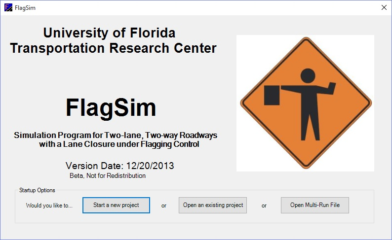
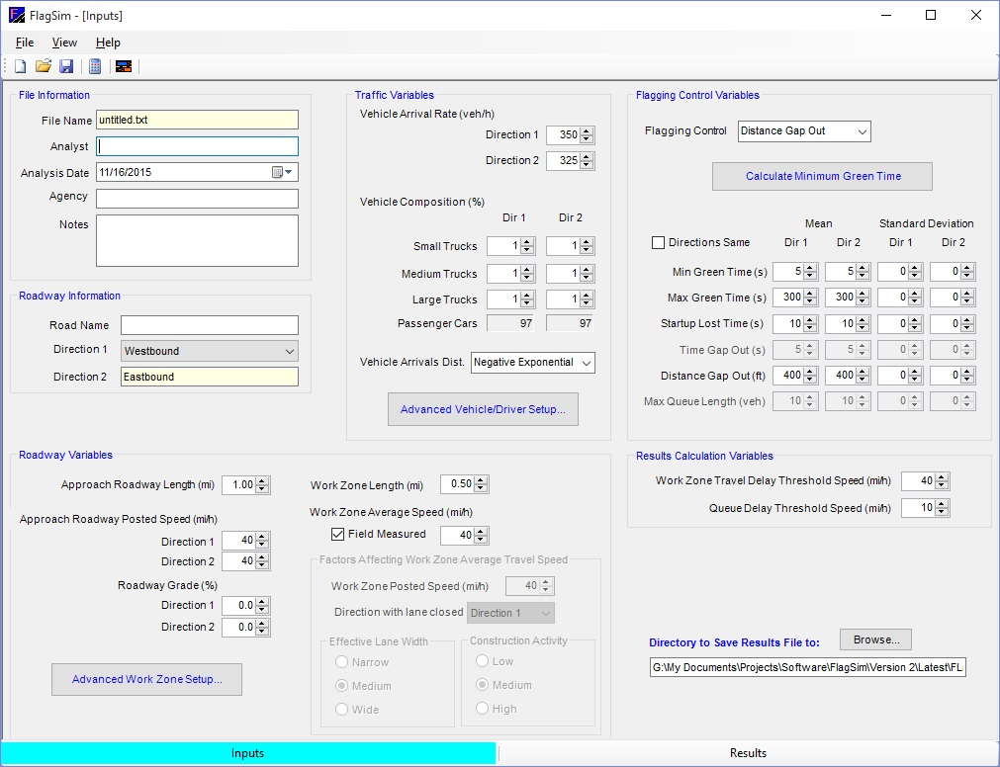
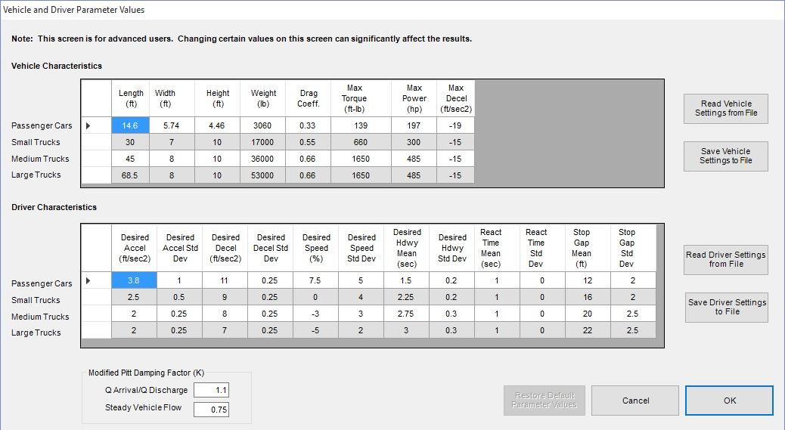
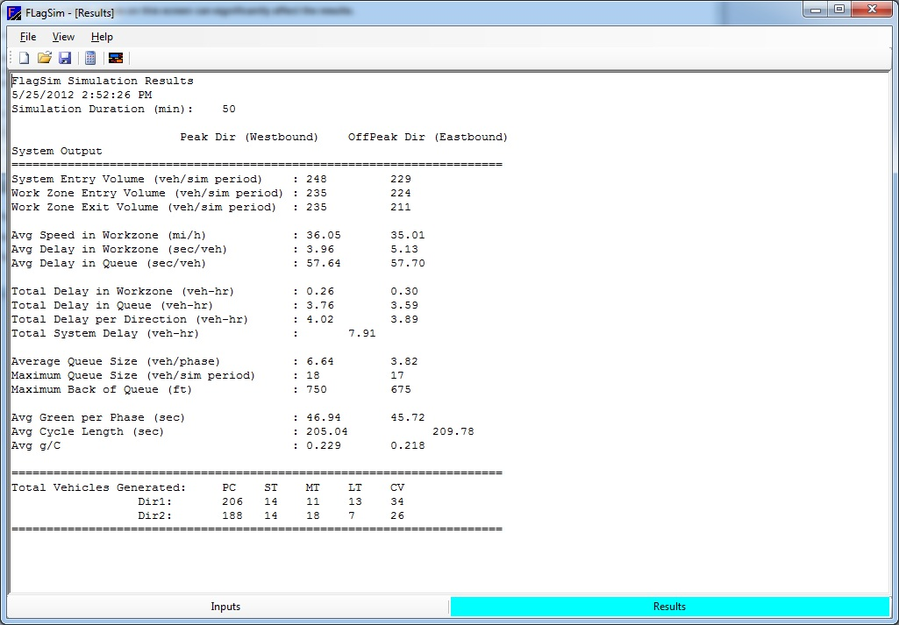
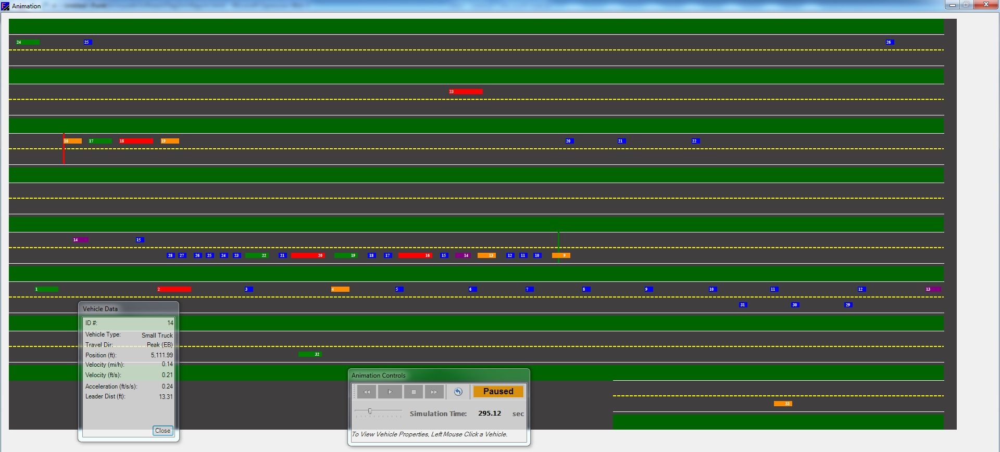

# FlagSim

FlagSim is a simulation program developed for the purpose of research and analysis of two-lane, two-way work zones under flagging or signal control. This program utilizes a stochastic, microscopic modeling approach. It is not intended or designed to be used for other roadway/work zone configurations, and is designed only for operations utilizing flagging or signal control, without a pilot car.

 
 

## Additional Information

* <a href="FLagSim_UsersGuide.pdf">FlagSim User Guide</a> 
* <a href="Final Report_BDK77-977-18.pdf">FDOT Report (January 2014)</a> 
* <a href="Final%20report_Part%20A.pdf">FDOT Report (January 2008)</a>

A release package will be available at this repository in the future. Until then, Email Dr. Washburn (swash@ce.ufl.edu) to obtain a copy of the program, free of charge.

**Inputs screen**

**Vehicle performance can be fine-tuned through the following screen**

**Performance measure summary results screen. Detailed output reports are also available as separate CSV files**

**Simulation animation screen**

